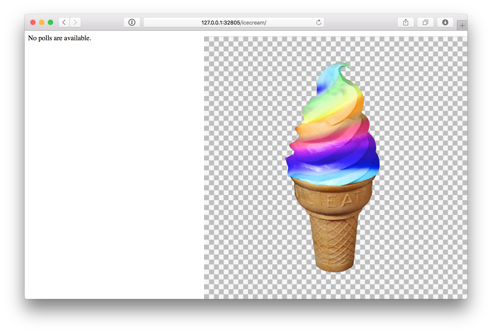
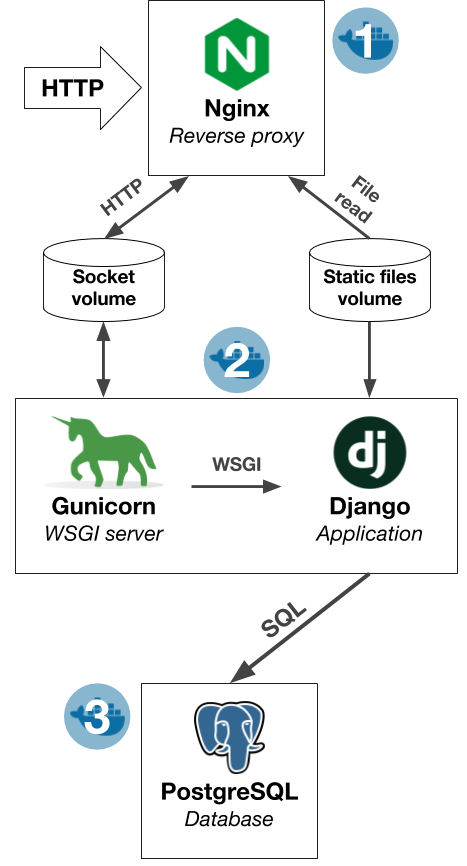

# seaworthy-demo

[](https://hub.docker.com/r/jamiehewland/seaworthy-demo/)
[](https://travis-ci.org/JayH5/seaworthy-demo)

A demo of [Seaworthy](https://github.com/praekeltfoundation/seaworthy) for my
Docker/Travis blog part 3

This repository is split into three directories:
 1. [`django`](django): All the Django project code and its Dockerfile
 2. [`nginx`](nginx): The Nginx configuration and Dockerfile
 3. [`seaworthy`](seaworthy): The Seaworthy test code

## Running the demo
Pull all the necessary images (optional—Seaworthy will quietly do this for you
if you don't):
```
docker pull jamiehewland/seaworthy-demo:django
docker pull jamiehewland/seaworthy-demo:nginx
docker pull postgres:alpine
```

Install Seaworthy (you probably want to be in a virtualenv):
```
cd seaworthy
pip install -r requirements.txt
```

Run pytest:
```
pytest -v test.py
```

### Debugging
To access the Django web app,
[insert a breakpoint](https://docs.pytest.org/en/latest/usage.html#setting-breakpoints)
into a test that uses the Nginx container, for example:
```diff
     def test_admin_page(self, nginx_container, django_container):
         """
         When we try to access a page served by Django, for example, the Django
         admin page, that page is returned via Nginx.
         """
+        import pdb;pdb.set_trace()
         client = nginx_container.http_client()
         response = client.get("/admin")

```

Run pytest again for the test:
```
pytest -v test.py::TestNginxContainer::test_admin_page
```

You should (eventually) get at a
[Python debugger shell](https://docs.python.org/3/library/pdb.html#debugger-commands)
from which you can inspect the containers in scope:
```
collected 1 item

test.py::TestNginxContainer::test_admin_page
>>>>>>>>>>>>>>>>>>>>>> PDB set_trace (IO-capturing turned off) >>>>>>>>>>>>>>>>>>>>>>>
> /Users/jamie/ws/seaworthy-demo/seaworthy/test.py(39)test_admin_page()
-> client = nginx_container.http_client()
(Pdb)
```

Here you can do cool things like inspect the Nginx container for its port:
```
(Pdb) nginx_container.get_first_host_port()
('127.0.0.1', '32805')
```

And then go to `http://127.0.0.1:32805/icecream` in your browser:



Note that you can also pass the `--pdb` option to pytest to jump to the Python
debugger when a test fails.

## Architecture


The Nginx container (1) receives incoming HTTP requests and proxies them to the
web application container (2). The web application container in the centre
contains the actual application: Django served using
[Gunicorn](http://gunicorn.org). This Django application needs a database to
store its data in, and that’s where the final part comes in — the PostgreSQL
database container (3).

The two volumes are Docker volumes that are shared between the Nginx and web
application containers. The “socket volume” contains Gunicorn’s Unix socket.
Nginx initiates HTTP requests to Gunicorn & Django via this socket. The second
volume is used to share
[Django’s static files](https://docs.djangoproject.com/en/1.11/howto/static-files/)
with Nginx, which Nginx can serve to users efficiently.
